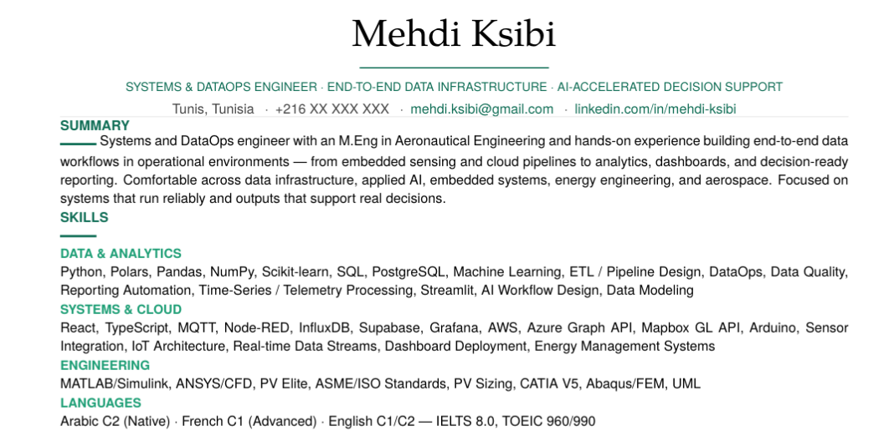
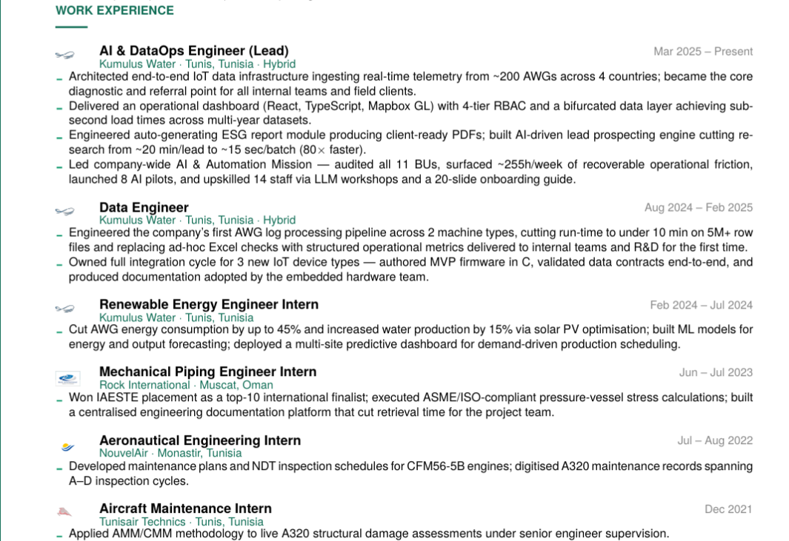
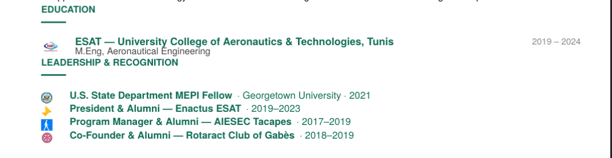

# latex-cv — Claude Skill

ATS optimisation has a side effect nobody talks about: every CV starts looking identical. Strip formatting, match keywords, use plain section names — and the document that passes the scanner is indistinguishable from the 46 others the recruiter reads that day.

This skill takes a different approach. It generates a **single-page LaTeX CV that passes ATS scanners without sacrificing the visual identity that makes a human want to keep reading** — packaged as a ready-to-compile Overleaf zip.

The key features:
- **Clickable company logos** next to each job entry, linking to the company website — gives the document visual rhythm, helps recruiters recognise companies at a glance, and disambiguates similar names across industries
- **100/100 section structure score** — achieved by fixing a silent LaTeX bug that causes most LaTeX CVs to score 0 on ATS section detection (see [ATS Compatibility](#ats-compatibility))
- **One-shot generation** — upload your CV, say *"build me a LaTeX CV"*, get a zip with `main.tex`, logos, and an Overleaf setup guide

---

## Preview





The output is a single A4 page with:
- Centered serif name + green accent rule
- Green left spine
- Clickable company logos and names (links to company websites)
- Clean section hierarchy optimised for both human readers and ATS systems

---

## ATS Compatibility

Tested using **[ats-screener.vercel.app](https://ats-screener.vercel.app/scanner)** against 6 major ATS platforms (Workday, Taleo, SuccessFactors, iCIMS, Greenhouse, Lever):

| Metric | Score |
|---|---|
| Overall | **80 / 100 — Excellent** |
| Keywords | **100** |
| Section Structure | **100** |
| Formatting & Parsing | **95** |
| All 6 platforms | **PASS** |

The key ATS insight built into this skill: LaTeX's `\addfontfeatures{LetterSpace=N}` causes ATS text extractors to read `S U M M A R Y` instead of `SUMMARY`, killing section detection. This template removes letter-spacing from all section headers and uses plain `\MakeUppercase` instead — fixing the most common LaTeX CV ATS failure.

---

## Installation

1. Download [`latex-cv.skill`](./latex-cv.skill)
2. In Claude Cowork, open **Settings → Skills → Install from file**
3. Select the downloaded `.skill` file

The skill is now available in any Cowork session.

---

## Usage

Upload your existing CV (PDF, DOCX, or plain text) and say any of:

- *"Build me a LaTeX CV from this"*
- *"Turn my CV into an ATS-compatible LaTeX PDF"*
- *"Make me an Overleaf CV"*
- *"Rebuild my resume in LaTeX"*

The skill will:
1. Parse your CV and extract all sections
2. Look up company website URLs
3. Generate or placeholder company logos
4. Produce a `main.tex` using the design template
5. Package everything into a zip with an Overleaf setup tutorial

---

## What's in the zip output

```
cv_overleaf.zip
├── main.tex              ← Your CV, ready to compile
├── logo_company1.png     ← Company logos
├── logo_company2.png
├── ...
└── OVERLEAF_SETUP.md     ← Step-by-step Overleaf tutorial
```

Compile in Overleaf with **XeLaTeX** (Menu → Compiler → XeLaTeX). That's it.

---

## Design decisions

### Why XeLaTeX?
The design uses `fontspec` to load system fonts (TeX Gyre Heros for body, TeX Gyre Pagella for the name). These fonts are available on Overleaf by default. `fontspec` requires XeLaTeX — pdfLaTeX will not work.

### Why these specific fonts?
TeX Gyre Heros is a clean, professional sans-serif closely related to Helvetica. TeX Gyre Pagella (based on Palatino) gives the name a distinctive serif weight that contrasts with the body. Both are freely available everywhere, so the CV compiles on any machine with a standard TeX distribution.

### Why no letter-spacing on section headers?
This is the single most important ATS fix in the template. Many LaTeX CV templates apply `\addfontfeatures{LetterSpace=22}` to section headers for a spaced-out visual effect. This causes ATS text extractors to read `S U M M A R Y` with spaces between every letter — the section is unrecognised, and the CV's section structure score drops to 0. This template uses `\bfseries\MakeUppercase` only, which renders visually similar but preserves correct text encoding.

### Why a graphical rule as bullet marker?
`\textcolor{accentlt}{\rule{4pt}{1.2pt}}` renders as a small coloured dash. Visually distinctive, ATS-neutral (the rule is not a text character, so it doesn't interfere with bullet content parsing). Standard `•` or `–` bullet characters can sometimes be misread by ATS extractors as part of the bullet text.

### Clickable URLs
The `\jobheader` and `\recogentry` commands each accept a URL argument. When provided, both the company logo and the company name become clickable `\href` links. When the URL is empty `{}`, no link is created. This makes the PDF useful both as an email attachment (interactive) and as a print document (visually identical).

---

## Repo structure

```
latex-cv-skill/
├── README.md
├── LICENSE
├── latex-cv.skill              ← Install this in Claude Cowork
├── skill/                      ← Skill source (human-readable)
│   ├── SKILL.md                ← Skill instructions for Claude
│   └── references/
│       ├── base_template.tex   ← Full LaTeX preamble + template
│       └── overleaf_guide.md   ← Overleaf setup tutorial
├── example/                    ← Demo CV (Mehdi Ksibi, phone redacted)
│   ├── main_demo.tex
│   ├── logo_*.png              ← Company logos
│   └── OVERLEAF_SETUP.md
└── preview/                    ← Screenshots
    ├── cv_preview_1.png
    ├── cv_preview_2.png
    └── cv_preview_3.png
```

The `.skill` file is a zip of the `skill/` directory. You can inspect or modify the source files and repackage using the [Claude skill-creator](https://github.com/anthropics/claude-code) tooling.

---

## Modifying the skill

The skill is built with the `skill-creator` tool inside Claude Cowork. To modify it:

1. Edit the files in `skill/`
2. Repackage: `python -m scripts.package_skill ./skill ./` (requires the skill-creator scripts from your Cowork installation)
3. Reinstall the updated `.skill` file

Key files to edit:
- `skill/SKILL.md` — the instructions Claude follows when running the skill
- `skill/references/base_template.tex` — the LaTeX design (colors, fonts, commands, layout)
- `skill/references/overleaf_guide.md` — the tutorial bundled in every output zip

---

## Known limitations

- **Experience Quality score** plateaus around 50/100 on ats-screener.vercel.app. This is a tool-specific ceiling caused by the graphical rule used as a bullet marker (`\rule{4pt}{1.2pt}`) not appearing in the PDF text stream, so the tool can't detect individual bullet boundaries for quantification scoring. It does not reflect a real parsing problem — the bullet content is fully readable by actual ATS systems.
- **Non-Latin characters** — Arabic, CJK, and some accented characters are untested. XeLaTeX handles Unicode well in principle but the specific fonts used (TeX Gyre Heros, TeX Gyre Pagella) may not cover all scripts. Contributions welcome.
- **Single-page constraint** — the template is tuned for a dense one-page CV. Longer CVs will need margin and font adjustments or a deliberate two-page layout.
- **ATS scores are from one tool** — results from other scanners (Jobscan, Resume Worded, etc.) may differ. If you test with another tool, please share your results via an [ATS Result issue](https://github.com/Mehdi-Ks/latex-cv-skill/issues/new?template=ats_result.md).

---

## Contributing

Found a bug, tested on a new ATS tool, or have an idea for improvement? See [CONTRIBUTING.md](./CONTRIBUTING.md) — the open questions list is a good place to start.

---

## License

MIT — use freely, modify, share. Attribution appreciated but not required.

---

## Credits

Built with [Claude Cowork](https://claude.ai) and the Claude skill-creator. LaTeX design developed and ATS-tested through iterative refinement with real ATS scoring tools.
